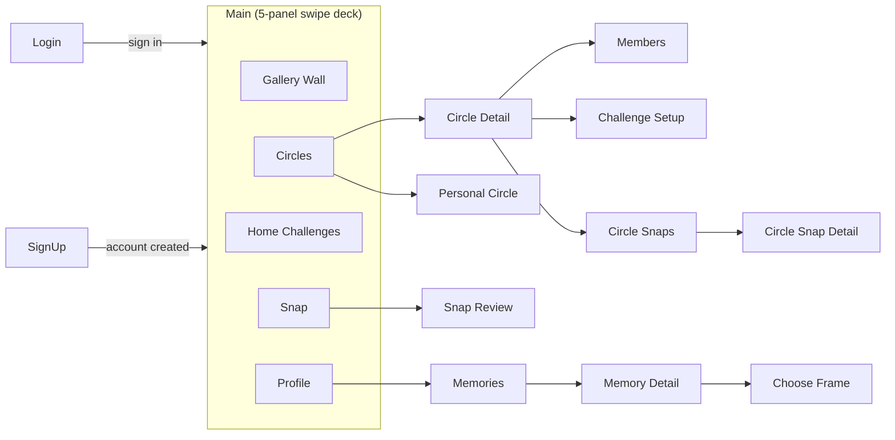
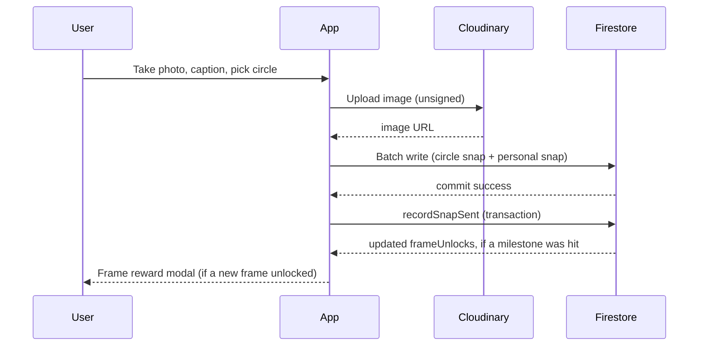
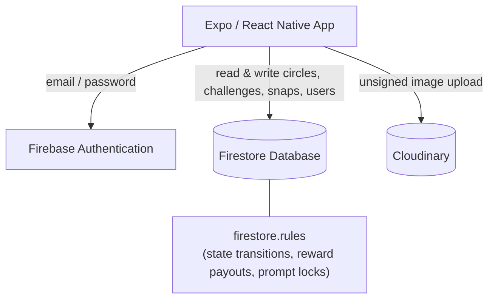

 

# Send Noodles

## Contents

- [Features](#features)
- [Screenshots](#screenshots)
- [Diagrams](#diagrams)
- [Tech Stack](#tech-stack)
- [Project Structure](#project-structure)
- [Prerequisites](#prerequisites)
- [Getting Started](#getting-started)
- [Backend Setup](#backend-setup)
- [Key Concepts](#key-concepts)
- [Notes](#notes)
- [Acknowledgements](#acknowledgements)


   


## Features

- **Circles** - create or join a friend group with an invite code, see members and a points scoreboard, and create challenges with a prize/wager attached for the group to work toward.
- **Personal Circle** - a card created automatically for every account, carrying the same prompt and the same daily challenge for every user of the app. It is solo use only, so there is no team, prize, or agreement step, just you and today's challenge.
- **Challenges** - proposed from a shared prompt bank and agreed on between you and your mates in the circle, moves through a setup, active, and completed state machine, and carries a countdown until it's due.
- **Snap & Send** - take a photo (front or back camera, shake-to-flip supported), caption it, and send it to your circle.
- **Gallery Wall** - sent snaps land on a wall of frames that can be rearranged and dragged around, with different reward frames to choose from for each one.
- **Circle Snaps Gallery** - every snap ever sent to a circle, browsable in a grid with captions, and full-screen swipeable detail view.
- **Memories** - a private, personal archive of every snap you've ever sent, independent of any one circle.
- **Reward Frames** - unlock new polaroid frame styles by hitting milestones (snap counts, challenge completions, team play, weekly challenges); unlocking triggers a celebration modal.
- **Guided Onboarding** - a first-run, step-by-step tour that walks a brand-new account through each of the app's five panels.
- **Profile** - avatar picker, unlocked frame swatches, personal stats (streaks, wins, points), settings, and account deletion.
- **Auth** - email/password sign up and login, persisted between app launches.


   

 
   


## Diagrams

### Navigation flow

The app has no tab bar. The signed-in experience is one horizontal 5-panel swipe deck (`SwipeNavigator`), with a handful of screens pushed on top of it as stack routes (`RootNavigator`) for drill-down tasks.



### Snap → reward unlock data flow

Sending a snap uploads to Cloudinary first, then writes to Firestore twice in one atomic batch (circle feed + the sender's private history), before a separate transaction checks whether that snap pushed the sender past a milestone.



### Backend architecture

There is no custom server. Firebase and Cloudinary are the entire backend, and Firestore's security rules carry the validation logic a server would normally own (challenge state transitions, reward payouts, prompt locking).



##  Tech Stack

| Layer | Technology |
|---|---|
| Framework | [Expo](https://expo.dev) ~54 / [React Native](https://reactnative.dev) 0.81 |
| Language | TypeScript |
| UI | React 19, custom components (no UI kit) |
| Navigation | [React Navigation](https://reactnavigation.org) (native stack) + [react-native-pager-view](https://github.com/callstack/react-native-pager-view) (swipe deck) |
| Animations & Gestures | react-native-reanimated, react-native-gesture-handler, react-native-worklets |
| Backend / Database | [Firebase](https://firebase.google.com) (Authentication + Firestore) |
| Image hosting | [Cloudinary](https://cloudinary.com) (unsigned uploads); Firestore only stores the resulting URL, since Firebase Storage requires a paid plan |
| Camera / Sensors | expo-camera, expo-sensors (shake detection), expo-image-manipulator, expo-haptics |
| Storage | @react-native-async-storage/async-storage (auth session persistence) |

##  Project Structure

```
send-noodles/
├── App.tsx                # App root (gesture handler, safe area, navigation)
├── index.ts                # Expo entry point
├── firebase/                # Firebase config, auth, and Firestore data access (circles, challenges, snaps, users, prompt bank)
├── cloudinary/               # Cloudinary config and upload helper
├── firestore.rules            # Firestore security rules
├── src/
│   ├── screens/               # Top-level screens (Circles, Snap, Gallery Wall, Profile, Memories, Auth, ...)
│   ├── components/              # Reusable UI, grouped by feature (auth/, circles/, challenges/, snap/, gallery/, frames/, profile/)
│   ├── navigation/              # React Navigation stack + swipe deck + types
│   ├── onboarding/              # First-run guided tour (context, overlay, steps, popup UI)
│   ├── hooks/                # Data-fetching and device hooks (useCircle, useFrameUnlockQueue, useShakeDetector, ...)
│   ├── constants/              # Theme, frames, avatar faces, illustrations, noodle images, personal circle challenge
│   ├── data/                 # Mock data used before/alongside live Firebase data
│   └── utils/                # Shared helper functions
└── assets/                  # Images, frames, illustrations, avatar faces
```

##  Prerequisites

- [Node.js](https://nodejs.org) 20+ (this project was built against Node 22)
- npm (comes with Node)
- The [Expo Go](https://expo.dev/go) app on your phone (easiest way to run it), **or** Android Studio / Xcode set up for a simulator
- A Firebase project and a Cloudinary account if you want your own backend (see [Backend Setup](#backend-setup) below). The repo currently ships with a working shared project's config, so this is optional to get started

##  Getting Started

```bash
# 1. Install dependencies
npm install

# 2. Start the Expo dev server
 npx expo start 
```


Then either:
- Scan the QR code with the **Expo Go** app on your phone, or
- Press `a` for Android emulator, `i` for iOS simulator, or `w` for web (in the terminal running the dev server)

### Other scripts

```bash
npm run android   # start and open on a connected Android device/emulator
npm run ios       # start and open on an iOS simulator (macOS only)
npm run web       # start and open in a browser
```

## Backend Setup

This app uses **Firebase** (Auth + Firestore) and **Cloudinary** (image hosting). To point the app at your own backend instead of the default configured project:

1. **Firebase**
   - Create a project at the [Firebase console](https://console.firebase.google.com).
   - Enable **Authentication → Email/Password**.
   - Create a **Firestore** database.
   - Copy your web app config into [`firebase/firebaseConfig.ts`](./send-noodles/firebase/firebaseConfig.ts).
   - Deploy the security rules in [`firestore.rules`](./send-noodles/firestore.rules) via `firebase deploy --only firestore:rules` (requires the [Firebase CLI](https://firebase.google.com/docs/cli)).


2. **Cloudinary**
   - Create an account at [cloudinary.com](https://cloudinary.com).
   - Add an **unsigned upload preset** under Settings → Upload → Upload presets.
   - Set your cloud name and preset in [`cloudinary/config.ts`](./send-noodles/cloudinary/config.ts).

##  Key Concepts

- **Circle** - a small group of friends, joined via an invite code, that shares challenges and a scoreboard.
- **Personal Circle** - a private, single-member circle every account has by default, for a standing solo daily challenge. There is no wager, team, or Firestore doc, just a constant read by the Home screen.
- **Challenge** - a task the circle agrees to do; has a due-by countdown and a set prize, like "buying drinks at the end of the week". Runs through a **setup → active/locked → completed** state machine enforced by Firestore security rules, since there's no server to trust otherwise.
- **Snap** - a photo submitted for a challenge, stored on Cloudinary with its URL saved in Firestore under the circle, and mirrored into the sender's own private snap history for Memories and the Gallery Wall.
- **Frame / Reward** - a unique frame  unlocked by hitting a milestone (snap count, challenges completed, team play, weekly challenges); unlocks are recorded on the user's own profile document and surfaced with a celebration modal.
- **Memories** - the personal, cross-circle archive of every snap a user has ever sent.
- **Onboarding tour** - a one-time, step-by-step walkthrough of the five main panels, started automatically for brand-new accounts.

##  Notes

- Written against **Expo SDK 54** - since Expo's API changes frequently between major versions, check the [versioned docs](https://docs.expo.dev/versions/v54.0.0/) if something doesn't match what you'd expect from older tutorials.
- Native `ios/` and `android/` folders are not checked in (Expo managed workflow) - they're generated on demand via `expo prebuild` if you ever need to eject.

## Acknowledgements

- **Illustrations, frame artwork, and noodle icons** used throughout the app are original artwork created for this project.
- **Lecturers and classmates** -for feedback, testing, and guidance throughout development.
- **[Claude](https://claude.com) (Anthropic)** -used as a development assistant for debugging, code review,initial layout, and drafting/structuring documentation.
- **Open-source libraries and services** this project is built on: [Expo](https://expo.dev), [React Native](https://reactnative.dev), [React Navigation](https://reactnavigation.org), [react-native-pager-view](https://github.com/callstack/react-native-pager-view), [react-native-reanimated](https://docs.swmansion.com/react-native-reanimated/), [react-native-gesture-handler](https://docs.swmansion.com/react-native-gesture-handler/), [Firebase](https://firebase.google.com), and [Cloudinary](https://cloudinary.com); see [Tech Stack](#tech-stack) for the full list.

<!--
  📸 ADD AN IMAGE HERE if you'd like a footer/closing image, e.g. the app icon
-->
